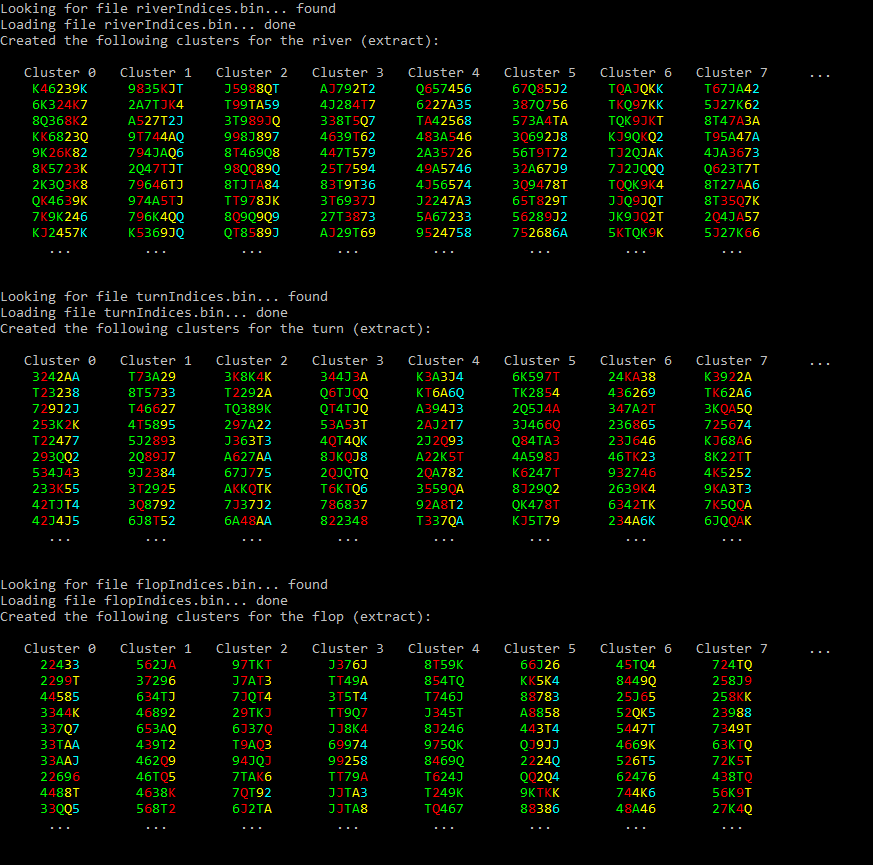

# Poker Bot


A poker bot for NL Texas Hold'em supporting any number of players and trained using Monte-Carlo Counterfactual Regret Minimization. 
The code more or less follows the [research paper](https://science.sciencemag.org/content/365/6456/885) on the poker bot Pluribus released by Facebook's AI Lab and Carnegie Mellon University in July 2019.

* **Poker-MCCFR repository**: Written in C#, can be used to generate the tables and train them. More than two players are not tested and some additional code changes are needed to set arbitrary raise sizes. **Discontinued**. 
* **Poker-MCCFR-CPP repository**: C++ version, much faster histogram generation, k-means++ clustering and training, includes live-search. 

## Poker-MCCFR repository (C#)

### Prerequisites
* Windows with Visual Studio (tested)
* .NET core 3.0+

## Poker-MCCFR-CPP repository (C++)

### Capabilities
- [x] Generate information abstractions (preflop, flop, turn and river tables)
- [x] Train on NL Texas Hold'em with a variable number of players
- [x] Display some training games and the starting hand action probabilities
- [x] Live search and live play
- [ ] Visualization of the poker table
- [x] Allow player vs AI games
- [x] Different raise sizes in different game rounds

### Prerequisites

* Windows with Visual Studio and c++17 or later 
* Clang compiler needed for the hand indexer library, install it using the VS installer
* Windows SDK Version 10 (others untested)
* A lot of RAM, 256+ GB suggested for 6+ players but depends on the the chosen information & action abstractions size

### Compilation

* Compile the project with -march=native and highest optimization level to achieve maximum performance on your system  
* Run the generated executable

### Configuration
* Most parameters can be found in the files *params.h* or *params.cpp*
```
// Hardware
nofThreads : The maximum number of threads used

// Game parameters
raises : The fractions of the pot which are valid bet sizes
buyIn : Generally 100 * Big Blind
nofPlayers: Number of players
BB : Big blind
SB : Small blind

// Information abstraction
nofOpponentClusters : Number of clusters used for OCHS clustering on the river
nofRiverBuckets : Number of clusters for the river
nofTurnBuckets : Number of clusters for the turn
nofFlopBuckets : Number of clusters for the flop
```
Note that imperfect recall is used after the flop.


### Example Run

#### Verification of hand indexer and performance benchmark
Cards such as AdKd and AcKc are suit isomorphic and hence can be treated as identical during training. For mapping poker hands to their canonical equivalent an algorithm developed by Kevin Waugh is used. More information can be found in the respective research paper ["Fast and Optimal Hand Isomorphism Algorithm"](https://www.aaai.org/ocs/index.php/WS/AAAIW13/paper/download/7042/6491). 


#### Clustering preflop hands
Starting hands are clustered into 16 (or as specified) opponent hand clusters by generating monte carlo samples up until the river and playing out against all possible opponent hands. The resulting equity histograms are clustered using earth mover's distance (EMD). These 16 clusters are helpful to reduce the time it takes to cluster the river. Note that the 169 possible preflop hands themselves are not clustered during training. In the image below the top left corner corresponds to the cards 22, the bottom right corner to the cards AA and all cards on the right side of the connecting diagonal are suited.


#### Calculating river, turn and flop histograms
For each of the suit isomorphic river hand combinations (2 + 5 cards) an equity histogram is calculated by counting the wins and draws against all possible opponent hand clusters. In a similar fashion, the turn (2 + 4 cards) and flop (2 + 3 cards) histograms are calculated. However, in the latter two cases it is possible to play against all opponent hand combinations and not just the 16 opponent hand clusters. 


#### Clustering the river, turn and flop histograms
River histograms are clustered using k-means++ with the Euclidean metric (L2) and the turn and flop histograms with earth mover's distance. A sample of some clusters can be seen below. The first two cards are the player's starting hands.   



#### Training
An example training run with two players, a buy-in of 200 each, a big blind of 2 and a small blind of 1 is shown below. Raises are set to 1, 2 and 3 times the pot for all betting rounds. A strong information abstraction of 1000 clusters for the flop, turn and river is used (169-1000-1000-1000).

After the initial 2'900'000 training iterations around 6 million infosets are visited and the following preflop action probabilities are calculated for the small blind player. 


Similarly, the following charts show the preflop actions of the big blind player after a given action by the small blind player. 


#### Result
At around 82'000'000 training iterations the following preflop tables are played. In particular, note that much fewer hands are folded and that very strong and rather weak hands are raised while the average hand is called.


Similarly, the charts showing the preflop actions of the big blind player after a given action by the small blind player.


The following shows some sample self-play games played by the evolved training table, where R0, R1 and R2 are 1, 2 and 3 pot raises respectively.


